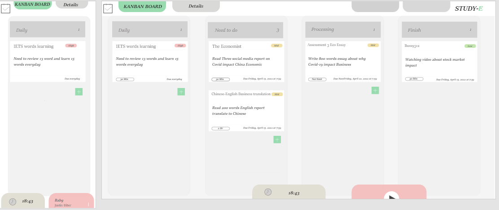

In this final web design, I learned many different things on this web and focused on doing each step by step. Such as, when I am doing js or HTML, I will first explain or comment on what I am doing in this step. This step is essential because I will sometimes forget when typing things. Then, I compared the proposed design to the final design and changed some dot points on the website. I am also improving some uncomfortable moments. Such as, in the proposed plan, I have not given the mockup to add a project to the kanban board. Here is the different what i am imporving
  
Because it depends on the feedback from the teacher, I find it is a vital function in my web. Also, I added with function in my time section. It shows rationable in my process form moving through the iteration and improvement. The first image shows the final project change, and the last two are early projects.
  

This solution is teach how to using the web and the changing from mockup to web 
From teacher feedback: I would have liked to see some more ideation and the process that lead you to the final mockups.
The more ideation and the process is showing in my web. 

This is the main page 

You can see the kanban board and calendar function on the main page. If you want to add a project to the kanban board, you can click add, which will show what your project title is; the task card can edit daily 1, 2, 3 or 4. also, on the due day, the task will do 1 hour or more. The content is descriptive of what is the mission for or doing. Then, the priority has high, mid or low to pick. It is easy to user understand what they need to do first. In the final step is to click add and the new project appear on the board.  (When I doing the mock up is not clear to showing what user need to do)

When you click the time machine, you will see the SavetimeMac, a quickset function that is easy for the user when they want to add half-hour. The minus is to minus 5 minutes, and the count is to add five more minutes. This saves users time when they are doing a project because some of the users do not focus on their mission. This idea reminds the user to do a job or study high efficacy when doing it. (This section is from teacher feedback and having change in web because in mockup I has not explain why this section is important and how to because a useful function)

   

When the user clicks, the switch function is easily changed to another called Stopwatch timer. This is also an iteration on the web. Because of user can record how long the task takes. 

Music player is a thing to helping user having more interset in the web. when they click on music and play button will play the music. also if user wants to fast-forwarded the music can drag the progress. (This is self-reflction from mockup has not finish this step)

